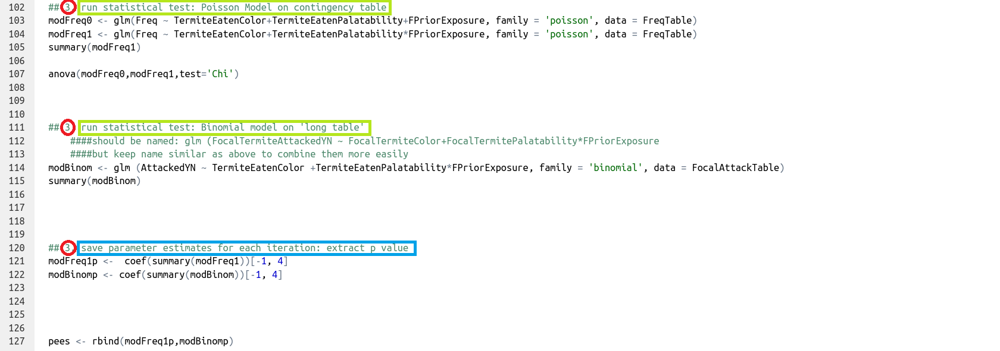
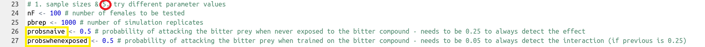
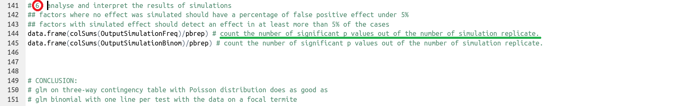

# Real life example of simulation

This is a walk through one relatively simple simulation written to check whether a  
generalized linear model on a contingency table of counts (poisson distribution) would provide the same results as a  
generalized linear model with one line per observation, and with the occurence of the variable of interest coded as Yes/No (binomial distribution).  

I created this code while preparing my preregistration for a simple behavioral ecology experiment:  
Methods for independently manipulating palatability and color in small insect prey ([article](https://doi.org/10.1371/journal.pone.0231205), [OSF preregistration](https://osf.io/f8uk9?view_only=3943e7bb9c5f4effbf119ca5b062fe80))  

The R code screenshoted below can be found in the folder [Ihle2020](./Ihle2020/glm_Freq_vs_YN.R).  

 

This walk through will use the steps as defined in the page '[general structure](./general-structure.md)'

1. **define sample sizes** (within a dataset, and number of replicates) and what will need to vary (e.g. the strength of the effect expected)  

  
 

2. **generate data**, random data or data including an effect. Variables are generated from their expected distribution or their class (e.g. factor vs numerical value)

  
 

3. **run the statistical test** you think is most ideal, check that the results are random (significant in only 5% of the case) or picking up the effect imposed/simulated in 80% of the cases (power), and **save the parameter estimate of interest for that iteration**  

  
 

4. **replicate** step 2 and 3 to get the distribution of the parameter estimates  

  
 

5. try out different parameter sets (**explore the parameter space** for which results are similar)  

  
 

6. **analyze and interpret the combine results of many simulations** within each set of parameters  

  
 

***

[Previous](./limitations.md) | [Next](./resources.md)
