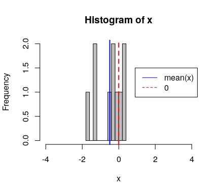

# Sample size `n`

How many values should you generate within a simulation? Let's explore.  

If I draw 10 data points from a normal distribution of mean 0 and sd 1, or N(0,1), after setting the seed to 10 (for no specific reasons), here is the distribution of the values I get:

**1 sim of N(0,1) with n=10**  
  
 

and if I replicate this simulation 24 times, here are the distributions of the 10 values pseudo-randomly sampled from N(0,1):  

**24 sims of N(0,1) with n=10**  
 
  
 

Note that because we are drawing from N(0,1), we expect the mean of the values drawn (mean(x), blue lines) to be very closed to 0, the mean of the normal distribution we sample from (red dashed lines).  
 

Let's see how distributed are the means and standards deviations of the 24 simulations of 10 sampled values from N(0,1) are:  

**mu and sd from 24 sims N(0,1) with n=10**  
 
  
 

Now, let's do the same with a sample size `n` of 1000.  

**24 sims of the same distribution N(0,1) with n=1000**  
 
  
 

**mu and sd from 24 sims N(0,1) with n=1000**  
 
  
 

### Conclusion  
The sample size within a simulation affects the **precision** with which the parameters of that distribution can be estimated.  

What should determine the sample size within a simulation?  
--> a sample size that is relevant to the context of the simulation, e.g. the sample size you will be able to reach in your study.
 
***

[Previous](./seed.md) | [Next](./sample-size-nrep.md) 

