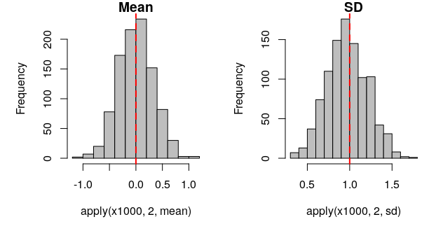

# Sample size `nrep`

Sampling theory applies to the number of simulations `nrep` just as much as the sample size `n` within a simulation.

**mu and sd from 24 sims N(0,1) with n=10**  
 
  
 

Now, let's do the same with a sample size `nrep` of 1000.  

**mu and sd from 1000 sims N(0,1) with n=10**   
 
  
 

### Conclusion  
The number of simulations needs to be a big enough number to obtain a good representation of the distribution of the simulation results, e.g. 1000. 

***

**YOUR TURN:**  
You can play with these graphs by running and modifying the examples provided in your local exercice script (e.g. changing parameters in turns)
 

***

[Previous](./sample-size-n.md) | [Next](./dry-rule.md)
