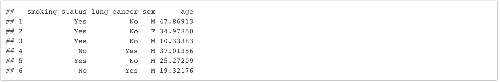
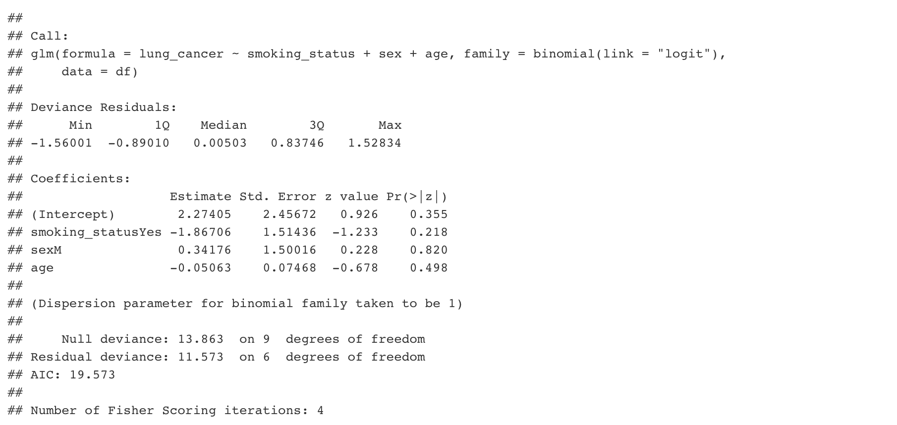

# Simulating data to check or pre-register code

One of the simplest uses of simulations is to make a dataset on which you can run and therefore pre-specify your analytic code. 

For example, let's say you plan to collect an observational dataset and want to look at the effect of smoking on lung cancer. 
A typical protocol might state that the data will be analysed by logistic regression, adjusting for confounders. 
But which confounders exactly? How will each variable be coded? What type of logistic regression will you use? 

Making a dataset that has the variables you expect your real dataset to use allows you to exactly state (in **code** rather than potentially ambiguous words) what you will do. 

This is really useful if you want input from e.g. a statistician - they can look at your code and more clearly see what you are trying to do. 
It has the added benefit of forcing you to really think about what your dataset will look like! I've found this to be very useful in the past.

It's very easy to make a dataset. Let's take a simple example. We are interested in only 4 variables:

* smoking status 
* lung cancer
* sex
* age

Here is the top of the simulated dataset. 

 
  
 

***

**YOUR TURN:**

1. Can you recreate it? Try it yourself! 

    HINT: use the `data.frame()`, `sample()`, and `rnorm()` functions.

2. Now you've made a dataset, try to run a logistic regression on your data with lung cancer as the outcome. 

***

We can look at the summary of our model and make sure it behaves as we expected. And we can share the code with collaborators or reviewers.

 
  
 

And that's it! We have written down our code in a way that is totally unambiguous. This practice is useful for any project and is very easy to do. You can include the exact code that you plan to use in a preregistration, and reviewers will be able to veryify that you did what you planned.

A real example of a simple simulation like this, used in the submission of a registered report, can be found in the rmd file [here](https://osf.io/5jf9p/).

## Further steps 

You can combine this approach with the sampling approaches you learned in the power/alpha simulation session to look at power for more complex datasets. 

*****

