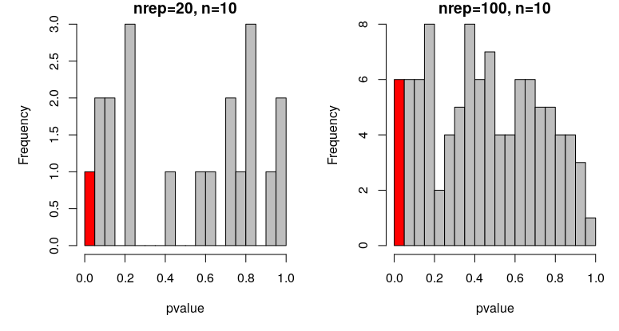
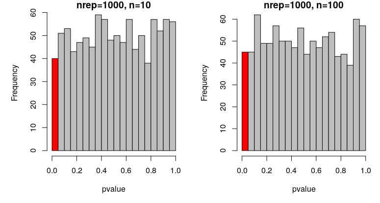

# First real simulation: checking alpha and power

In most quantitative sciences we accept a type 1 error rate of "0.05", which is often called the `alpha` or significance level. This value tells us the probability of rejecting the null hypothesis (i.e. of finding an effect) given that the null hypothesis is true (i.e. that the alternative hypothesis that we test isn't true). 

In other words, if there is no true effect (e.g. no difference between two groups), we would expect our null hypothesis of no effect to be rejected (incorrectly), `alpha`% of the time.

If you draw from the same distribution twice, will the mean of the two samples differ significantly in 5% of the cases? 

***

**YOUR TURN:**  
Figure out how to do a t test in R  
Generate two vectors of 10 values drawn from N(0,1) and compare them with a t test  
Figure out how to extract the p-value from that object (explore your R object with the functions `str` or `names`)    
Write a function simT that generates two vectors of `n` random normals, compare them with a t test and return the p-value  
Repeat with `nrep`=20 and draw a histogram for `n`=10  
Repeat with `nrep`=100 and draw a histogram for `n`=10

***

**p-values of t tests comparing means from 20 or 100 sims N(0,1) with n=10**   
 
  
 

In the first case, where `nrep` = 20, we expect 1 out of the 20 tests to be significant (5%). In my case, I got 2. How many did you get?    
In the second case, where `nrep` = 100, we expect 5 out of the 100 tests to be significant. In my case, I got 4. How many did you get?      
Are those deviations meaningful? Significant? 

***

**YOUR TURN:**  
Plot the output of the function simT with `nrep`=1000 and `n`=10  
Plot the output of the function simT with `nrep`=1000 and `n`=100

***

**p-values of t tests comparing means from 1000 sims N(0,1) with n=10 or n=100**   
 
  
 

In both cases, we expect 50 out of the 1000 tests to be significant by chance (i.e. with a p value under 0.05). In my simulations, I get 59 and 48 false positive results, for `n`=10 and 100, respectively. How many did you get?  

These proportions are not signicantly different from 5%. 

`prop.test(59, 1000, p = 0.05, alternative = "two.sided", correct = TRUE)`  
1-sample proportions test with continuity correction  
data:  59 out of 1000, null probability 0.05  
X-squared = 1.5211, df = 1, p-value = 0.2175  

It is important to note that, although `alpha = 0.05` is commonly used, this is an arbitrary choice and you should consider what is an appropriate type 1 error rate for your particular investigation.

***

**YOUR TURN:**  
What happens if you use non-normally distributed data? e.g. Poisson distributed data?
What happens if you vary lambda?  

***

**p-values of t tests comparing means from 20 or 100 sims Poisson(3) with n=10**   
 
  
 

**p-values of t tests comparing means from 1000 sims Poisson(3) with n=10 or n=100**   
 
  
 

The proportion of false-positive results are all close to 5% of the tests performed, for this Poisson distribution I drew from (with a lambda of 3). Did you get similar results with different lambda?  

To generalize such observation, and assert that using t test for Poisson distributed data does not lead to more false positive than expected by chance, one would need to explore the entirety of the parameter space (i.e. test this for all possible lambda).  

Please note that I do not suggest you use t tests to compare Poisson distributed data (such as counts). There may be other problems than creating false positive results that need consideration (and that perhaps other simulations could help us examine).

***

## Checking power through simulations
The power of a statistical test tells us the probability that the test correctly rejects the null hypothesis. In other words, if we only examine true effects, the power is the proportion of tests that will (correctly) reject the null hypothesis. Often, the power is set to `0.8`, though, as with `alpha = 0.05`, this is an arbitrary choice. 

Generally, we want to do power analysis before collecting data, to work out the sample size we need to detect some effect. If we are calculating a required sample size, the power analysis can also be called a sample size calculation. 

Taking the example of a t-test, we need to understand a few parameters:

* `n`, the sample size
* `delta`, the difference in means that you want to be able to detect. Deciding what this value should be is tricky. You might rely on estimates from the literature (though bear in mind they are likely to be inflated), or you can use a 'minimally important difference': you specify the threshold below which you do not think a difference is interesting enough to be worth detecting. In a clinical trial, this might be the smallest difference that a patient would care about, for example. 
* `sd`, the standard deviation. Usually this needs to be estimated from the literature or from pilot studies. 
* `sig.level`, the alpha, as discussed above. 
* `power`, the power as defined above

You can calculate any one of these parameters, given all of the others. We usually want to specify, `delta`, `sd`, `sig.level` and `power` and calculate the required sample size.

We can calculate the required sample size for a t.test using:
`power.t.test(n = NULL, delta = 0.5, sd = 1, sig.level = 0.05, power = 0.8)`

Notice that `n = NULL`, so this parameter is calculated. 

The sample size `n` we need given this set of parameters, is `64` per group.

Just as we can check the alpha of our test by sampling from the same distribution (i.e. simulating data without an effect), we can check the power by sampling from different distributions (i.e. simulating data with an effect).

***

**YOUR TURN:**  
Use your simulation skills to work out the power through simulation.
Write a function which:

1. Draws from two random normal distributions with different means and a given sample size

2. Compares the means with a t.test and extracts the p.value

Replicate the function 1000 times using the parameters used in the power calculation.

Calculate the proportion of p-values that are <0.05

***

**p-values of t tests comparing means from 1000 sims N(0,1) and N(0.5, 1) with n=64**  

 
  
 

The proportion of correctly rejected null hypotheses in the simulation is close to `0.8`, which is what we would expect. 

Using simulations for power analysis is not really necessary for simple examples like a t-test, though it is useful to check your understanding. 

When analyses become complex and it is hard or impossible to determine a sample size analytically (i.e. you can't calculate it, or there's no suitable function to use), then simulations are an indispensible tool.

A simple example of a power analysis like the one you've just done can be found in the "Power analysis" section of this paper:
* Blanco, David, et al (2020). "Effect of an editorial intervention to improve the completeness of reporting of randomised trials: a randomised controlled trial." BMJ open 10.5: e036799. https://doi.org/10.1136/bmjopen-2020-036799

***

[Previous](./dry-rule.md) | [Next](./general-structure.md)

