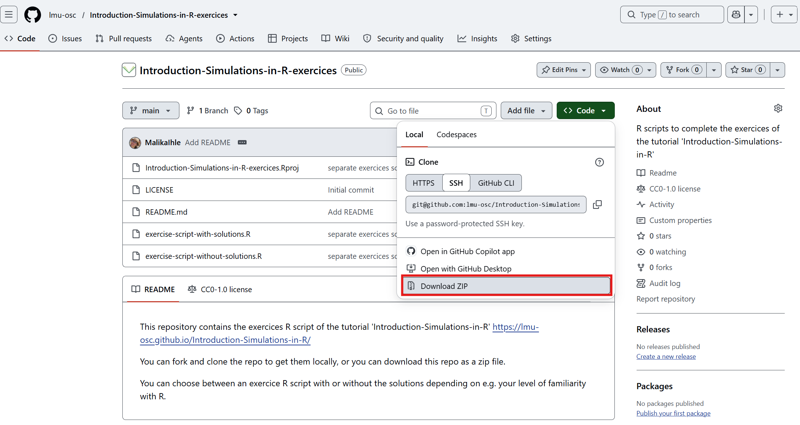
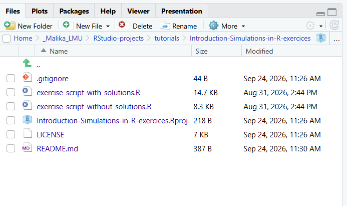

## Fetch the exercises material

You have two options to fetch this material:

### A. You know version control with Git and GitHub
Fork and clone the exercises repository associated with this tutorial: <a href="https://github.com/lmu-osc/Introduction-Simulations-in-R-exercices" target="_blank">https://github.com/lmu-osc/Introduction-Simulations-in-R-exercices</a> ([here](https://lmu-osc.github.io/Collaborative-RStudio-GitHub/) is a reminder on how to do this).

### B. You do not know version control

Download the exercises repository associated with this tutorial: <a href="https://github.com/lmu-osc/Introduction-Simulations-in-R-exercices" target="_blank">https://github.com/lmu-osc/Introduction-Simulations-in-R-exercices</a>.

 
  
 

Once the .zip file downloaded, extract it and place the folder in the desired directory (e.g. Documents).  

## Open the RStudio project  

If you do not have R or RStudio installed, please follow [these instructions](https://lmu-osc.github.io/Introduction-RStudio-Git-GitHub/installing_software.html) first.  

Find the downloaded (and extracted) folder and double click on the .Rproj file. 

In the panel containing the 'Files' tab, find the exercise sheet of your choice (with or without solutions) and open it by clicking on it.  
 
  
 

 ***

