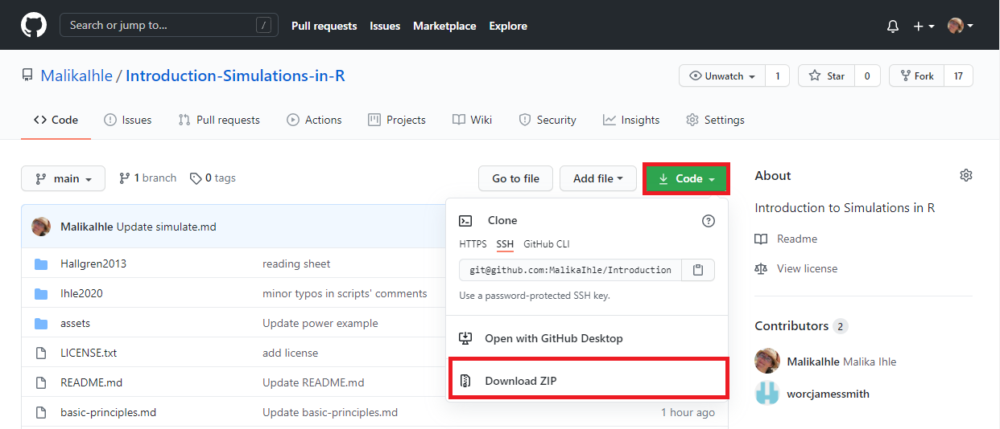
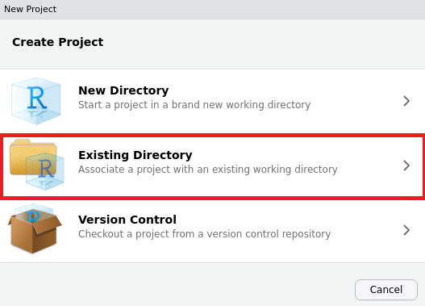
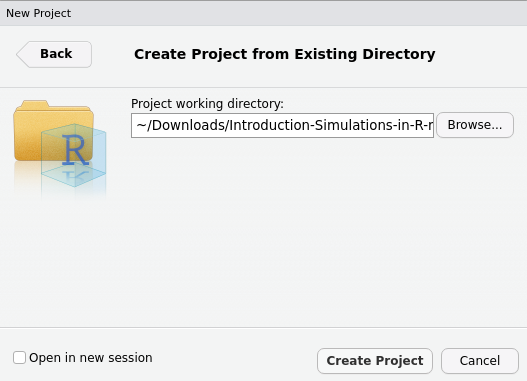
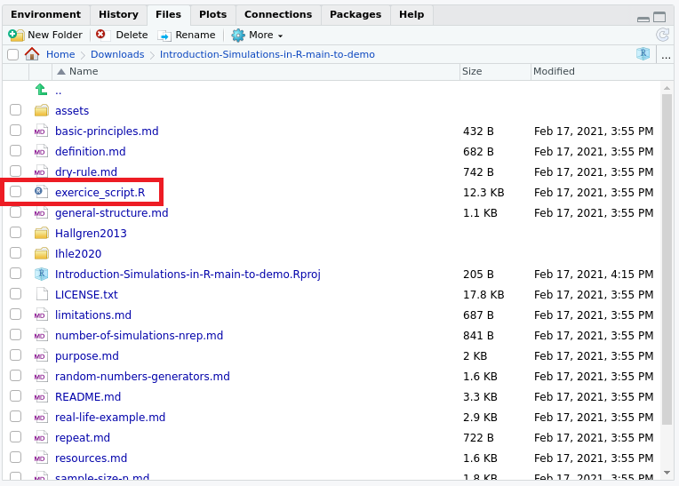

# Download the repository and make it a local RStudio project

**1) Download the repository**  

 
  
 

Here is the GitHub repository we are using today: https://github.com/MalikaIhle/Introduction-Simulations-in-R. Once the .zip file downloaded, extract it and place the folder in the desired directory (e.g. Documents).  

**2) Turn it into a RStudio project**  

If you do not have R or RStudio installed, please follow [these instructions](https://github.com/MalikaIhle/Introduction-RStudio-Git-GitHub/blob/master/installing_software.md) first.  

Open RStudio, and go to 'File', 'New Project...', and select 'Exisiting Directory'.  
 
  
 

Select the downloaded (and extracted) folder, by clicking on 'Browse', then select 'Create Project'.   
 
  
 

In the panel containing the 'Files' tab, find the exercise sheet, and open it by double clicking on it.  
 
  
 

 ***

[Previous](https://malikaihle.github.io/Introduction-Simulations-in-R/) | [Next](./definition.md)  
