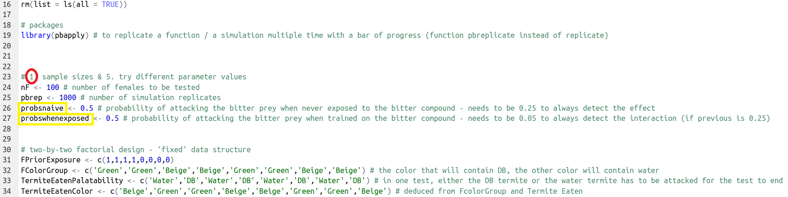
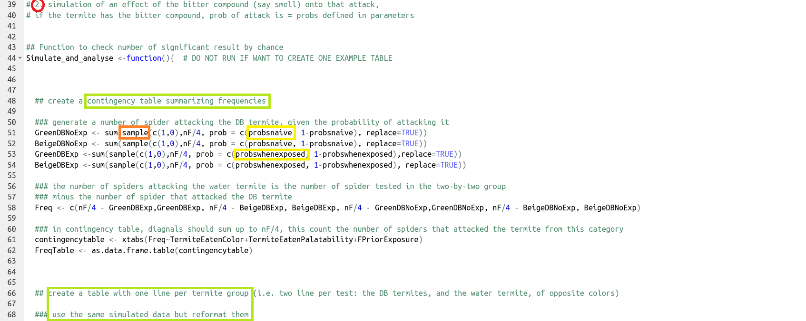
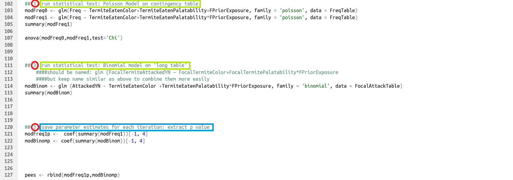
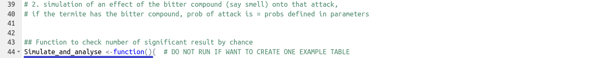
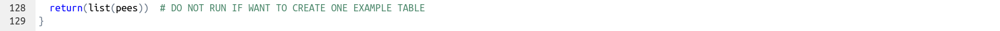
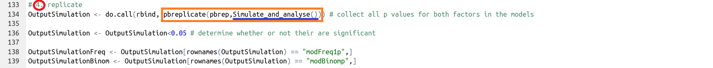
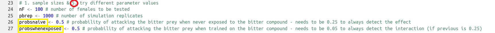
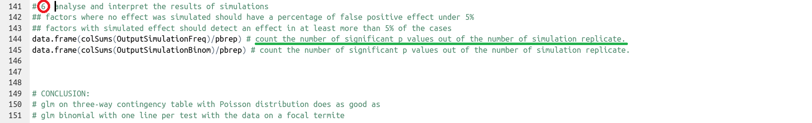

# Real life example

This is a walk through one relatively simple simulation written to check whether a  
generalized linear model on a contingency table of counts (poisson distribution) would provide the same results as a  
generalized linear model with one line per observation and  the occurence of the variable of interest coded as Yes/No (binomial distribution).  

I created this code while preparing my preregistration for a simple behavioral ecology experiment:  
Methods for independently manipulating palatability and color in small insect prey ([article](https://doi.org/10.1371/journal.pone.0231205), [OSF preregistration](https://osf.io/f8uk9?view_only=3943e7bb9c5f4effbf119ca5b062fe80))  

The R script screenshoted below can be found in the folder [Ihle2020](./Ihle2020/glm_Freq_vs_YN.R).  

 

This walk through will use the steps as defined in the page '[general structure](./general-structure.md)'

1. **define sample sizes** (within a dataset, and number of replicates), **experimental design** (fixed dataset structure, e.g. treatment groups, factors) and **parameters** that will need to vary (here, the strength of the effect)  

      
     

2. **generate data** (here, using `sample()` and the probabilities defined in step 1 and format it in two different ways to accomodate the two statistical tests to be compared. 

      
     

3. **run the statistical test and save the parameter estimate of interest for that iteration**. Here, this is done for both statistical tests to be compared.    

      
     

4. **replicate** step 2 (data simulation) and 3 (data analyses) to get the distribution of the parameter estimates by wrapping these steps in a function  

    definition of the function at the beginning: 
     
        
     
    output returned from the function at the end:  
     
      
     
    replicate the function `nrep` number of times. Here `pbreplicate` is used to provide a bar of progress for R to run this command.    
     
      
     

5. **explore the parameter space**. Here, vary the probabilities of sampling 0 or 1 depending on the treatment group category.

      
     

6. **analyze and interpret the combine results of many simulations**. In this case, the results of the two models were qualitatively the same (comparison of results for a few simulations), and both models gave the same expected 5% false positive results when no effect were simulated. Varying the effect (the probability of sampling 0 or 1 depending on the experimental treatment) allowed to find the minimum effect size for which the number of positive results is over 80% of the tests. 

      
     

***

[Previous](./limitations.md) | [Next](./resources.md)

